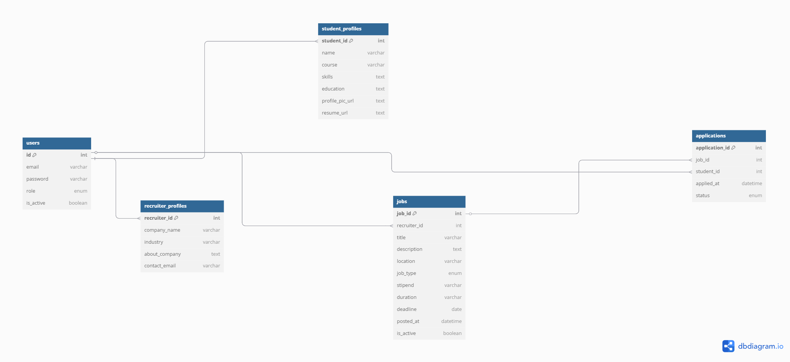

# 📂 Zidio Connect – Database Repository

This repository contains the complete MySQL database design for the **Zidio Connect Internship Platform**, built as part of a 2-month internship project. It includes schema definitions, sample data, dashboard views, admin analytics queries, and resume upload handling through file management.

---

## 📌 Project Overview

**Zidio Connect** is an internship/job portal where students can apply for jobs, recruiters can post listings and manage candidates, and admins oversee users and platform activity.

This repository provides the backend MySQL setup for:
- User role-based management (Student / Recruiter / Admin)
- Resume file uploads (PDF/Word)
- Dashboards via SQL Views
- Admin analytics via queries

---

## 🧱 Folder Structure

zidio-database/
├── schema/
│ └── zidio_connect_schema.sql # Creates DB and all tables
├── data/
│ └── sample_data.sql # Inserts sample users, jobs, applications
├── views/
│ └── dashboard_views.sql # Views for dashboards (student/recruiter/admin)
├── queries/
│ └── admin_analytics.sql # Optional analytics queries for admin panel
├── docs/
│ └── zidio_er_diagram.png # ER diagram of database
└── README.md


---

## ⚙️ Setup Instructions

1. **Create the database and tables**
```sql
SOURCE schema/zidio_connect_schema.sql;

SOURCE data/sample_data.sql;

SOURCE views/dashboard_views.sql;

SOURCE queries/admin_analytics.sql;


👥 Role-Based Access
👨‍🎓 Students
Register/login

Upload resume (PDF/Word file stored as filename)

Apply to internships/jobs

Track application status

🧑‍💼 Recruiters
Post job/internship listings

View applicants

Shortlist/reject candidates

🛡️ Admin
Approve/block users

View system reports

Moderate content

Admin Dashboard Metrics
Provided via custom queries and SQL views:

Total users by role

Applications by status

Students without applications

Jobs nearing deadline

Recruiters with most job posts

🗂 ER Diagram
The following image represents the relationship between all core entities in the database:


